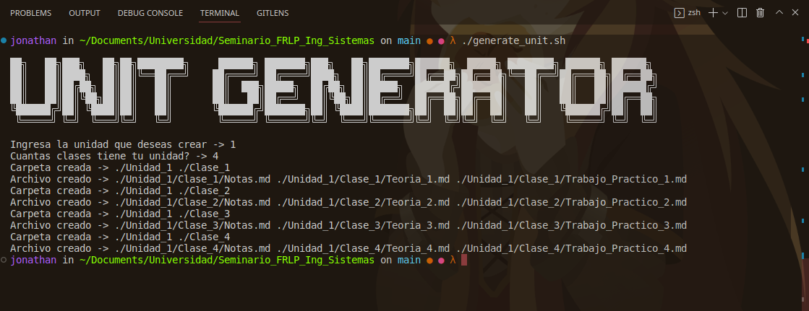

# 🖥 Seminario_FRLP_Ing_Sistemas

- Apuntes personales sobre el seminario 2023 de la UTN-FRLP para la carrera de ingenieria
- Script para automatizar la creacion de carpetas y archivos varios


# 📔 Notas

- Unidad #1 Aritmetica -> Desaprobado
- Unidad #2 Algebra -> Desaprobado
- Unidad #3 Geometria Analitica -> Desaprobado
- Unidad #4 Trigonometria -> Desaprobado
- Unidad #5 Matematica aplicada a la fisica -> In progress

# 💾 Descargar script

- Si no queres clonar el repositorio para poder utilizar los scripts podes directamente bajar el codigo en el siguiente [LINK](https://github.com/jd-apprentice/Seminario_FRLP_Ing_Sistemas/archive/refs/heads/main.zip)
- Ese link descarga el repositorio en un ZIP lo cual despues podes extraer y utilizar los scripts a gusto

# 🪛 Script de utilidad para crear unidades

## 🧰 Necesario para poder ejecutar el script

- Git
- Bash (Linux)
- Powershell (Windows)

## 🐧Linux

```bash
git clone git@github.com:jd-apprentice/Seminario_FRLP_Ing_Sistemas.git
cd ./Seminario_FRLP_Ing_Sistemas
chmod +x ./scripts/GU_Linux.sh
./scripts/GU_Linux.sh
```

## 🪟 Windows

```shell
git clone https://github.com/jd-apprentice/Seminario_FRLP_Ing_Sistemas.git
cd ./Seminario_FRLP_Ing_Sistemas
./scripts/GU_Windows.ps1
```

## 📁 Generamos las siguientes carpetas de la siguiente forma

```
📦Unidad_1
 ┣ 📂Clase_1
 ┃ ┣ 📜Notas.md
 ┃ ┣ 📜Teoria_1.md
 ┃ ┗ 📜Trabajo_Practico_1.md
 ┣ 📂Clase_2
 ┃ ┣ 📜Notas.md
 ┃ ┣ 📜Teoria_2.md
 ┃ ┗ 📜Trabajo_Practico_2.md
 ┣ 📂Clase_3
 ┃ ┣ 📜Notas.md
 ┃ ┣ 📜Teoria_3.md
 ┃ ┗ 📜Trabajo_Practico_3.md
 ┗ 📂Clase_4
 ┃ ┣ 📜Notas.md
 ┃ ┣ 📜Teoria_4.md
 ┃ ┗ 📜Trabajo_Practico_4.md
```

### 📔 Ejemplo de uso para el script


